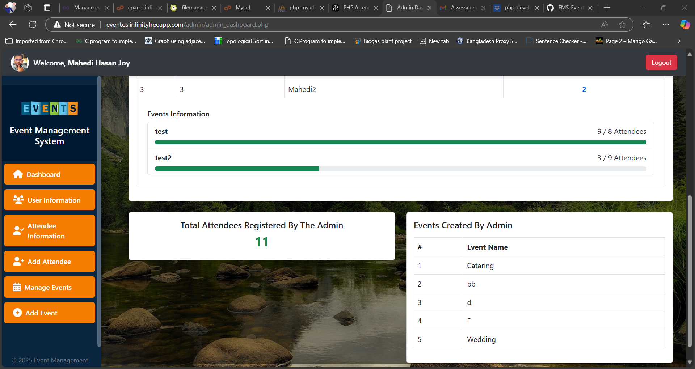

# EMS - Event Management System

A comprehensive **Event Management System** (EMS) built with PHP, MySQL, and Bootstrap. This project provides a seamless interface for managing events and attendee registrations. Users can create, update, and manage events, while the system enforces capacity limits and provides real-time feedback.

---

## 📋 Project Overview

This Event Management System enables users to:
- Register and log in securely.
- Create, update, and delete events.
- Register attendees while enforcing event capacity limits.
- Download event attendee reports as CSV files (Admin only).

Hosted on **InfinityFree**: [Visit the Website](http://eventos.infinityfreeapp.com/)

---

## ✨ Features

### Core Functionalities
1. **User Authentication**:
   - Secure user registration and login using hashed passwords.
   - Admin and user roles for different access levels.

2. **Event Management**:
   - Authenticated users can create, update, view, and delete events with details such as:
     - Event name
     - Description
     - Maximum capacity

3. **Attendee Registration**:
   - Users can register for events.
   - Prevents registrations beyond the maximum capacity of events.

4. **Event Dashboard**:
   - Displays events in a paginated, sortable, and filterable format for better management.

5. **Event Reports**:
   - Admins can download attendee lists for specific events in CSV format.

---

## 🚀 Installation Instructions

### Prerequisites
Ensure you have the following installed:
- [XAMPP](https://www.apachefriends.org/) for hosting the project locally.
- PHP 7.4 or higher.
- MySQL database.
- Git for version control.

### Steps to Set Up the Project
1. **Clone the Repository**:
   ```bash
   git clone https://github.com/10HoneyBee01/EMS-Event-Management-System.git
   cd EMS-Event-Management-System
2. **Set Up the Database**:
   ## Import the database.sql file into your MySQL database:
   ```bash
   mysql -u root -p event_management < database.sql
3. **Update the database credentials in database/db.php**:
   ```bash
   $servername = "localhost";
   $username = "root";
   $password = ""; // Default XAMPP password
   $dbname = "event_management";
5. **Run the Project Locally**:
   ## Place the project files in the htdocs folder of XAMPP.
   ## Start Apache and MySQL services in XAMPP.
   ## Access the application in your browser at:
   ```bash
   http://localhost/EMS-Event-Management-System

## 🔑 Login Credentials for Testing

### Admin
- **Email:** mahedi.hasanjoy1234@gmail.com  
- **Password:** 1234  

### User
- **Email:** jitu@mail.com  
- **Password:** 1234  

## 🖼️ Screenshots

### 1. Login Page


### 2. Admin Dashboard



### 3. Event Management Page


### 4. Registration Page


### 5. Download CSV Report


## 🗂️ Project Structure

       ```plaintext
       📁 EMS-Event-Management-System/
       ├── 📁 Admin/
       │   ├── add_event.php
       │   ├── admin_dashboard.php
       │   ├── attendees.php
       │   ├── deleteUser.php
       │   ├── events.php
       │   ├── footer.php
       │   ├── header.php
       │   ├── register_attendee.php
       │   ├── sidebar.php
       │   ├── updateRole.php
       │   ├── updateuserinfo.php
       │   └── user.php
       ├── 📁 User/
       │   ├── add_event.php
       │   ├── user_dashboard.php
       │   ├── attendees.php
       │   ├── events.php
       │   ├── header.php
       │   ├── register_attendee.php
       │   ├── sidebar.php
       │   ├── updateuserinfo.php
       │   └── user.php
       ├── 📁 Database/
       │   └── db.php
       ├── 📁 Uploads/
       │   └── images/
       ├── index.php
       ├── login.php
       ├── logout.php
       ├── register.php
       └── README.md


## 🛠️ Usage Instructions

### Admin Access:
- Log in as an **admin** to manage events, attendees, and user roles.
- Download attendee reports for events.

### User Access:
- Log in as a **user** to view and register for events.
- Register attendees until the maximum capacity is reached.

## 📝 License
This project is open source and available under the MIT License.

## 🤝 Contribution Guidelines
Contributions are welcome! Here’s how you can contribute:

1. Fork the repository.
2. Create a new branch:
   ```bash
   git checkout -b feature/your-feature-name
3. Make your changes and commit them:
      ```bash
   git commit -m "Add your feature"
4. Push your changes:
   ```bash
   git push origin feature/your-feature-name

## 📧 Contact
For any queries or feedback, feel free to reach out:

- **GitHub:** [10HoneyBee01](https://github.com/10HoneyBee01)
- **Email:** mahedi.hasanjoy1234@gmail.com
